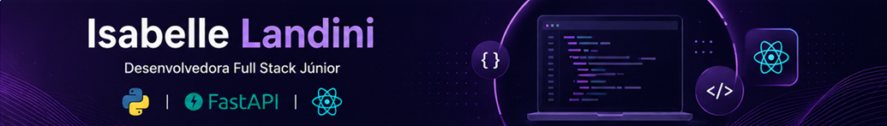

  

🚀 Desenvolvendo aplicações web com Python, FastAPI e React

📚 Foco em APIs REST, interfaces modernas e boas práticas de desenvolvimento

🎯 Aberta a oportunidades como Desenvolvedora Full Stack Júnior

---

## 👩🏻‍💻 Sobre Mim

Sou Desenvolvedora Full Stack Júnior em transição de carreira para a área de Tecnologia, com experiência no desenvolvimento de aplicações web e APIs REST.

Atuo principalmente no desenvolvimento Back-end com Python, utilizando FastAPI, SQLAlchemy, SQLite e boas práticas de organização de código.

Também desenvolvo interfaces responsivas com React, JavaScript, HTML e CSS, ampliando continuamente meus conhecimentos para uma atuação Full Stack.

---

## 🚀 Stack

### 🔙 Backend

Python • FastAPI • APIs REST • SQLAlchemy • SQLite• Pydantic

### 🎨 Front-end

React • JavaScript • HTML • CSS • Tailwind CSS

### 🛠️ Ferramentas

Git • Docker • GitHub Actions

### 📚 Em evolução

Next.js • Arquitetura de Aplicações

---

## 📌 Projetos

### 🔙 Backend

#### 🐉 Pokémon API

API RESTful desenvolvida com FastAPI para consulta e gerenciamento de dados, aplicando boas práticas de desenvolvimento backend.

**Tecnologias:** FastAPI • Pydantic • Paginação • Docker • Testes Automatizados • CI/CD • Deploy
 
🔗 [Ver Projeto](https://github.com/IsabelleLandini/pokemon-api)
🌐 [Aplicação Online](https://pokemon-api-u9so.onrender.com/docs)

---

#### 📚 Books API

API REST desenvolvida com FastAPI com foco em organização de código, persistência de dados e boas práticas no desenvolvimento backend.

**Tecnologias:** Python • FastAPI • SQLAlchemy • Pydantic • SQLite • Docker • Testes Automatizados

🔗 [Ver Projeto](https://github.com/IsabelleLandini/books-api-fastapi)

---

### 🎨 Front-end

#### 🛍️ Catálogo de Produtos

Aplicação web desenvolvida em React para exibição e gerenciamento de produtos.

**Tecnologias:** React • JavaScript • Vite • Componentização • Props • Hooks • useState • useEffect

🔗 [Ver Projeto](https://github.com/IsabelleLandini/catalogo-produtos)

---

#### 🐾 Pet&Style

Landing page responsiva desenvolvida utilizando Tailwind CSS, aplicando boas práticas de criação de interfaces modernas.

**Tecnologias:** HTML • Tailwind CSS • Responsividade • Componentização • UI Design

🔗 [Ver Projeto](https://github.com/IsabelleLandini/petstyle-loja-virtual)

---

## 📫 Contato

&nbsp;&nbsp;&nbsp;&nbsp;
&nbsp;&nbsp;&nbsp;&nbsp;

---

