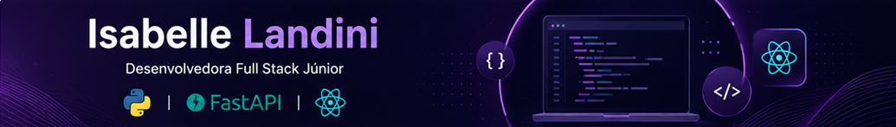

  

<h2 align="center">
🚀 Desenvolvedora Full Stack Júnior | Python • FastAPI • React • TypeScript • Next.js
</h2>

## 👩🏻‍💻 Sobre Mim

Estou em transição de carreira para desenvolvimento de software, com foco em **Backend Python e desenvolvimento Full Stack**.

Tenho desenvolvido aplicações utilizando **Python, FastAPI, React, TypeScript e Next.js**, aplicando conceitos como APIs REST, componentização, integração com banco de dados, testes automatizados e boas práticas de código.

Busco uma oportunidade como **Desenvolvedora Backend Python Júnior ou Full Stack Júnior**, contribuindo com dedicação, aprendizado contínuo e evolução técnica.

---

## 🚀 Stack

### 🔙 Backend

### 🎨 Front-end

### 🛠️ Ferramentas

---

## 📌 Projetos

### 🔙 Backend

#### 🐉 Pokémon API

API RESTful desenvolvida com FastAPI para consulta e gerenciamento de dados, aplicando boas práticas de desenvolvimento backend.

**Tecnologias:** Python • FastAPI • Pydantic • Docker • Docker Compose • Pytest • GitHub Actions
 
🔗 [Acessar repositório](https://github.com/IsabelleLandini/pokemon-api)
🌐 [Aplicação Online](https://pokemon-api-u9so.onrender.com/docs)

#### 📚 Books API

API REST para gerenciamento de livros desenvolvida com FastAPI, utilizando arquitetura organizada em camadas, persistência de dados e validação de schemas.

**Tecnologias:** Python • FastAPI • SQLAlchemy • Pydantic • SQLite • Docker • Docker Compose

🔗 [Acessar repositório](https://github.com/IsabelleLandini/books-api-fastapi)

### 🎨 Front-end

### 🌍✈️ Portal Viagens Next.js

Portal de viagens desenvolvido com Next.js, React e TypeScript.

Aplicação utilizando App Router, rotas dinâmicas, componentes reutilizáveis, CSS Modules e organização de dados locais.

**Tecnologias:** Next.js • React • TypeScript • CSS Modules

🔗 [Acessar repositório](https://github.com/IsabelleLandini/portal-viagens-nextjs)

### 📚 Catálogo de Livros

Aplicação React + TypeScript integrada com API REST para gerenciamento de livros.

Implementa criação, listagem, remoção e atualização de dados, utilizando componentes reutilizáveis, hooks personalizados e tipagem estática.

**Tecnologias:** React • TypeScript • Axios • Vite • API REST

🔗 [Acessar repositório](https://github.com/IsabelleLandini/catalogo-livros)

### 📋 Todo List 

Aplicação de gerenciamento de tarefas desenvolvida com React, aplicando gerenciamento de estado, criação de componentes reutilizáveis e boas práticas de organização de código.

**Tecnologias:** React • JavaScript • Vite • Context API • Hooks Customizados • LocalStorage

🔗 [Acessar repositório](https://github.com/IsabelleLandini/todo-list-recoil)

## 📫 Contato

&nbsp;&nbsp;&nbsp;&nbsp;
&nbsp;&nbsp;&nbsp;&nbsp;

